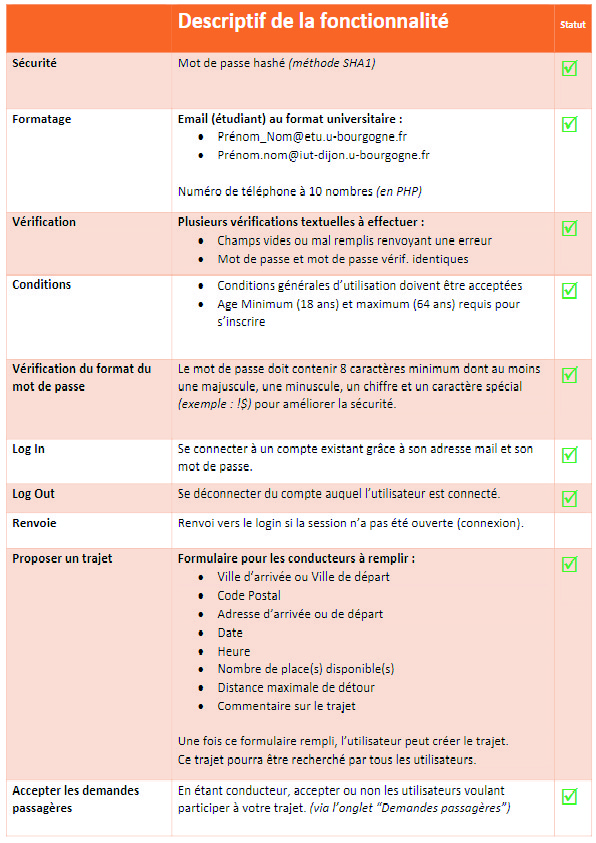
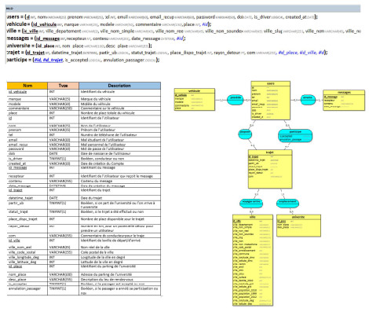

# Ub Covoit

Ub’Covoit est une plateforme de mise en relation des étudiants inscrits à l’U.B dans le
cadre du covoiturage. Cette plateforme sera développée pour un support Web.
Ub’Covoit donne deux possibilités primaires à ses utilisateurs. Ils peuvent proposer un
trajet et/ou rechercher un trajet. Les utilisateurs auront la possibilité de communiquer
entre eux directement sur la plateforme. 
 

# Fonctionnalités dévellopées

                                                                 
# Base de donnée

 

[Ub'Covoit - Rapport short.pdf](https://github.com/davidgolay/Ub-covoit/files/7148197/Ub.Covoit.-.Rapport.short.pdf)
