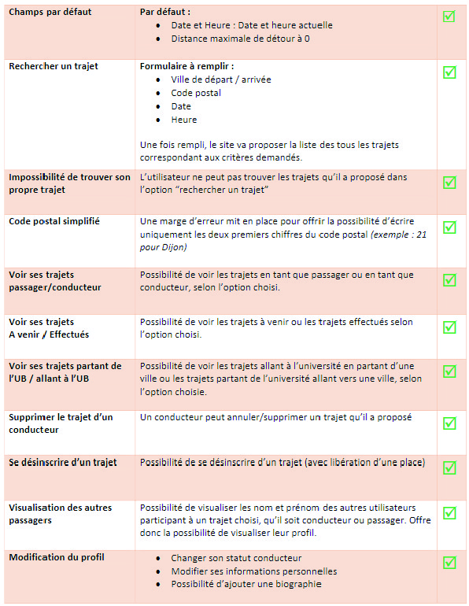
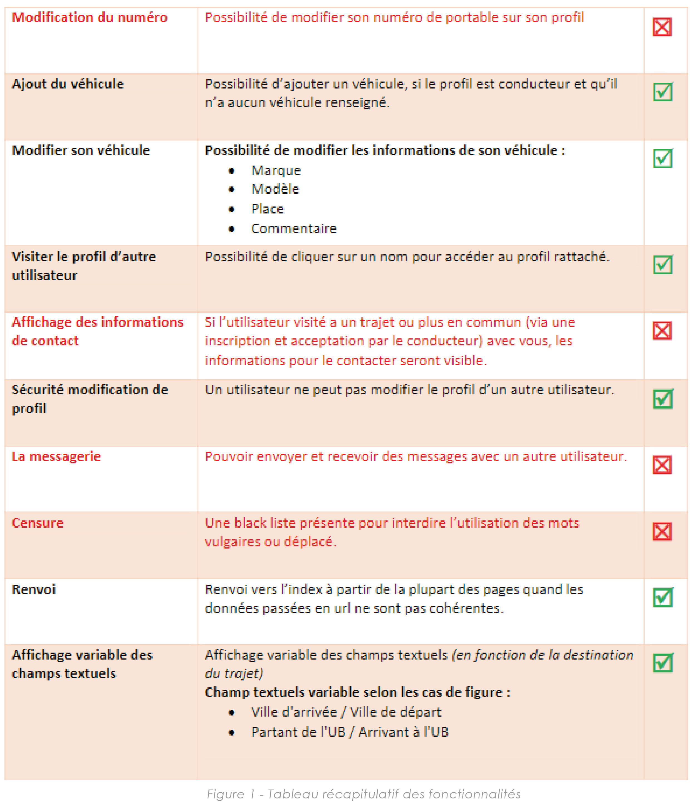
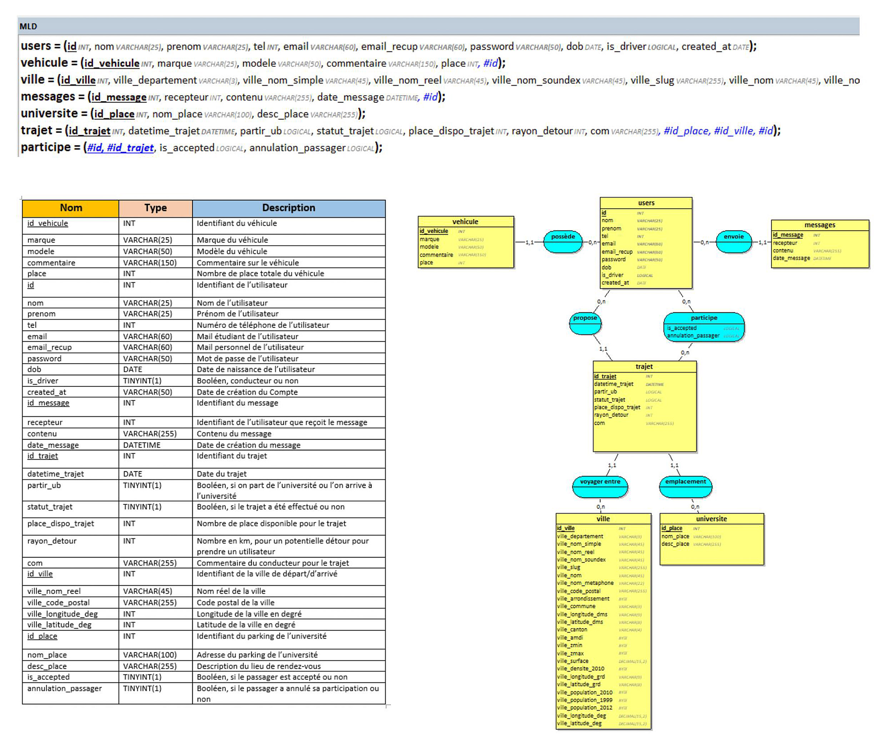

<h2> ❓ Qu'est ce qu'Ub'Covoit ❓ </h2>

Ub’Covoit est une plateforme de mise en relation des étudiants inscrits à l’U.B dans le
cadre du <b>covoiturage</b>. Ub’Covoit donne deux possibilités primaires à ses utilisateurs. Ils peuvent <b>proposer un
trajet et/ou rechercher un trajet</b>. Les utilisateurs auront la possibilité de communiquer
entre eux directement sur la plateforme.

*<b> ⚠️ Ce projet a été dévelloppé dans un cadre pédagogique lors de notre 1er semestre à l'IUT Informatique de Dijon-Auxerre.
Les droits associés appartiennent à l'IUT de Dijon-Auxerre. Par conséquent, Ub'Covoit n'est pas disponible en ligne. Il est toutefois publié sur un réseau privé de l'IUT. </b>*
   

<h2>:family_man_man_boy_boy: L'équipe </h2>
  <ul>
  <li><b> :blond_haired_person: David Golay </b> 
      Chef de projet chargé de coordonner,
      superviser et répartir les tâches distribuées aux membres de l’équipe grâce à un
      planning. Develoopement de la majeure partie du site en PHP.</li>
    <li><b> :curly_haired_woman: Eileen Lorenzo </b> 
      Directrice artistique, web designeuse, développeuse multimédia et
      intégratrice web chargée principalement de l’expérience utilisateur, de la conception
      graphique et de l’identité visuelle du site.</li>
    <li><b> :curly_haired_man: Alexandre Perzo </b>  
      Développeur informatique chargé de soutenir son équipe pour la
      conception du fond du site web. Responsable de l’hébergement et des mises à jour du
      site.</li>
    <li><b> :boy: Lucas Moniot </b> 
  Maintenance de la BDD et création d'un lot de donnée pour offrir à l’équipe la possibilité
    de tester cette dernière.</li>
  </ul>
   
 
<h2> 🖱️ Les technologies </h2>
<b> ➡️ EDI & Softwares: </b> Visual Studio Code, SQL Workbench 
   
<b> ➡️ Langages: </b> PHP, MySql, HTML5, CSS
   

<h1> 📖 Table des matières </h1>
<ul>
  <li><h2> 1️⃣ Captures d'écran </h2></li>
  <li><h2> 2️⃣ Fonctionnalités dévelloppées </h2></li>
  <li><h2> 3️⃣ Base de donnée </h2></li>
  <li><h2> 4️⃣ Guide utilisateur </h2></li>
</ul>
   

# 🖼️ Capture d'écran

   

# 🧰 Fonctionnalités dévelloppées
*Ce tableau récapitule toutes les fonctionnalités que nous avons incorporées au site Ub'Covoit.

  
  
  

                                                                 
# 💾 Base de donnée
*La base de données que nous avons établi contient plus de 78 000 villes françaises grâce à la récupération de données libres de droit que nous avons intégré à notre structure.*
<h2>Dictionnaire des données</h2>

  

   

 # 👤 Guide utilisateur

   
